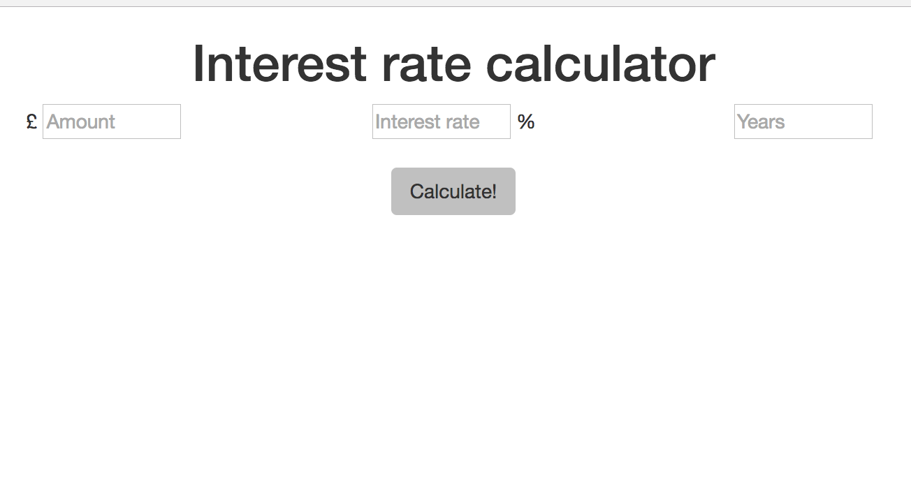

# CFG: LSE - Javascript Exercise

## Aim
The aim of this excercise is to use javascript to make a simple web form functional and interactive. More specifically, you will build a web page which, given an initial amount in GBP, an annual interest rate and a number of years calculates the amount of money you will have after that number of years.

To get you started, you are provided with a simple form which looks like this:

However, the form is **not yet functional**: When you click the "Calculate!" button the text "Hi, there" appears in the web page. Your program the page in javascript so that it displays the result of the compound interest calculation. 

## Task 0: Download, read and understand the existing code
Download the master branch of this repository as zip file, uncompress it and open the folder.

There's three files you care about:
* **index.html**, which contains the HTML for the interest calculator. In the head section, you will notice that jQuery and Bootstrap are loaded already. In its body section you will see tags for the three input boxes and the calculate button. There's an empty div with the ID "result" in the end. This is where our javascript program will put the result after the Calculate button is pressed.
* **style.css**, which contains some simple styling rules for the elements in the page. Understand what these do.
* **app.js**, the javascript file you'll be doing most of the work in. Read the comments and try to understand every line. 

## Task 1: Calculating and displaying the final amount
It's good to define some example use cases before starting on the implementation. After we implement the calculation feature, we can come back to the example and see if our implementation calculates what we expected.

Say the user inputs 100 GBP as the initial amount, 8% as the interest rate and 1 as the number of years. When the user clicks the "Calculate!" button, the text "108" should appear. If the user changes the number of years to 3, and presses calculate, the text "125.9712" should appear.

Our code for this task will go in the `calculate` function, which is executed every time the button is clicked. Before we do any calculations, we need to extract the user input from the page. In other words, we need to save the contents of the three text boxes in javascript variables. Read the documentation on jQuery's [.val()](http://api.jquery.com/val/) method to learn how to do this. Try typing a number in the "Amount" textbox, then open the javascript console and type `$("#amount").val();`. What did the function `.val()` return?

Once you have the three numbers the user entered in three different javascript variables (maybe you named them `amount`, `years` and `interest`?), you can start thinking about how to calculate the final amount. There's at least two ways to do it:
1. *Simulate* the passing of years in a [for loop](https://developer.mozilla.org/en/docs/Web/JavaScript/Reference/Statements/for). Maintain an `amount` variable throughout the year, and at the end of every year, update the new amount by adding the interest for that year.
2. Find a formula which gives you the result directly. Javascript's [Math.pow()](https://developer.mozilla.org/en-US/docs/Web/JavaScript/Reference/Global_Objects/Math/pow) function might prove useful. This is the easiest way.

Last, but not least, make the script display the result in the div with the "result" id.

## Task 2: Error handling
What happens if the user enters a negative number of years? Or a negative amount or interest rate? Or something that's not even a number in one of the textboxes? What if the user doesn't enter anything at all and presses calculate?

These are all examples of *bad user input*. Instead of attempting to calculate a nonsense result, your script should detect these errors and inform the user that they made a mistake, by using a pop-up for example.

Change the calculate function to detect bad input values. For example, you could check that the interest rate is a number, and that's strictly greater than zero. Devise similar sanity checks for the rest of the values and implement them. If the user made a mistake, you can use the [window.alert()](https://developer.mozilla.org/en-US/docs/Web/API/Window/alert) function to inform the user.

## Task 3: A clear button
Add a "Clear" button next to the "Calculate" button, which:
* Empties all three textboxes.
* Hides the result, if one was displayed.

You will need to add the HTML for the button and possibly style it. Then you'll have to define a handler function and use jQuery to make it execute whenever your button is clicked. See how this is done for the calculate function. Of course, you'll have to make your function do what you want as well.

Make sure you didn't break the initial calculator functionality.

## Task 4 (optional): Display a table with the amounts at the end of every year.

When the calculate button is clicked, instead of the final amount, display a small table with the projected amount at the end of every year up to the final year.

This task is more challenging than the others, and you'll have to use a for loop in which you dynamically create the table. Before you start, make sure to understand what you want to implement. Write down an example use case, and draw the table you'd expect to see.

## Extensions
* Using alert boxes is not a good UI experience. Make any errors appear in the page, instead of using pop-ups.
* Add a text box where the user can input a yearly amount which they contribute to their savings account. Change your calculate method to take this amount into account.
